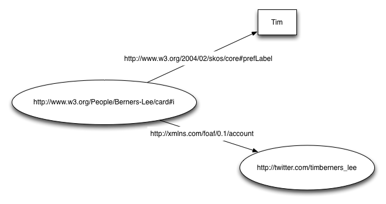

###
RDF
###

.. sectionauthor:: Alvaro Graves <alvaro@graves.cl>

This chapter shows how to use data available in RDF (Resource Description Framework)

(Very) brief description of what is RDF
***************************************

The Resource Description Framework is a W3C specification to describe information 
on the Web. It is a graph-based language that uses **URIs** (Universal Resource Identifier)
to identify resources such as web pages, people, past wednesday and describe information
about such resources. Thus for example, Tim Berners-Lee (the inventor of the
Web) is identified by `http://www.w3.org/People/Berners-Lee/card#i
<http://www.w3.org/People/Berners-Lee/card#i>`_

The basic unit of information in RDF is a *triple*, which consists in three
Elements: The first one identifies a *subject* (the resource that is being
described), the second describes the *predicate*, a type of relation or attribute the subject has. Finally, the third describes
the *object*, which is the value or resource associated to the subject via the
predicate. For example, if we want to say that "the prefered name for Tim
Bernes-Lee is 'Tim'" we can create the following triple:

 <http://www.w3.org/People/Berners-Lee/card#i> <http://www.w3.org/2004/02/skos/core#prefLabel> "Tim"

The "<" and ">" characters encloses a URI. Thus, we can add more information (say, "Tim has the twitter account http://twitter.com/timberners_lee")
simply by adding more triples

 <http://www.w3.org/People/Berners-Lee/card#i> <http://xmlns.com/foaf/0.1/account> <http://twitter.com/timberners_lee>

Graphically what we have is a graph where each URI can be linked to others of
can be given values in different values.

Further Reading
===============

For a more comprehensive and detailed description of RDF, please refer to the
`RDF Primer <http://www.w3.org/TR/rdf-primer/>`_ which describes in more details
URIs, blank nodes, literals, etc.

Obtaining data from SPARQL endpoints
************************************
